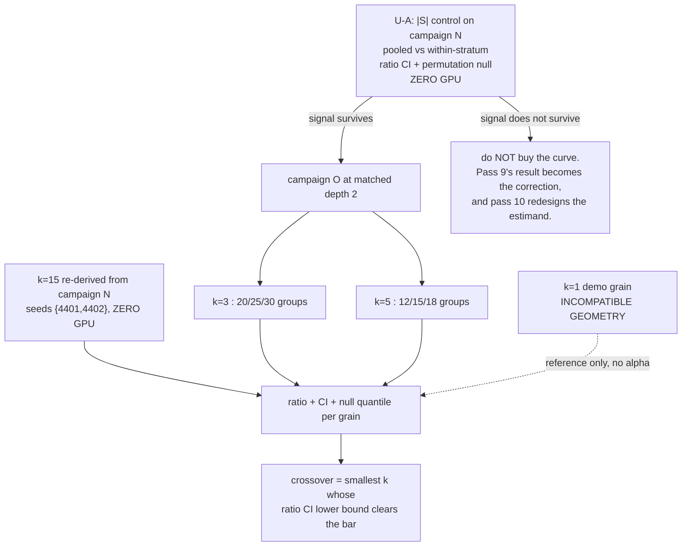

# feat: Pass 9 — put the cluster-grain result on a controlled footing, then locate the grain crossover

**Target repo:** RoboTDA-X (`~/code/RoboTDA-X` on box `h200-1`). All paths repo-relative.

---

## Revision history

**v1 -> v2.** v1 proposed buying grains k=3 and k=5 and inheriting k=1 and k=15 to make a four-point
crossover curve. Two independent checks broke it before any GPU was spent:

1. **An adversarial review** found the four points were not one estimand — they differ in seed
   depth (k=15 at depth 4, campaign O at depth 2), in mask geometry (demo-grain masks retain 7-8 of
   every cluster and never remove one whole, so k=1 is not "the same estimand at small k"), in an
   unspecified conditioning rule at sub-cluster grain, and possibly in statistic (v1's R1 demanded
   one statistic while its KTD4 re-selected it per grain). It also found v1's blind design stage
   **uncomputable**: there are no sub-cluster outcomes anywhere in the repo to resample, so pass 8's
   `p8_design.py` precedent does not transfer. And it found the depth-2 choice biases the absolute
   bar *toward the pass's own hypothesis*.
2. **A failed leakage control** (`p9_datamodel_cluster.permutation_control`) returned Kendall 0.425
   on shuffled outcomes where it had to return ~0 — which turned out not to be leakage but the |S|
   training-set-size effect, and which implicates campaign N's committed primary rather than the
   estimator being tested.

The two converge on the same defect: **|S| is not controlled where it matters.** v2 therefore
reorders the pass. Establishing what the cluster-grain number is worth under an |S| control now
comes first, because if the pass-8 headline does not survive that control, the crossover curve is
measuring the confound at four grains instead of one.

---

## Summary

Pass 8 reported that at cluster grain plain `GradDot_dmean` cleared the absolute half-ceiling bar
(ratio 0.707 Kendall, 149 OOS masks) — the first estimator to clear it in eight passes — and that
every self-influence correction from passes 4-7 reversed sign.

Pass 9 does four things:

1. **U-A. Re-examine campaign N's primary under an |S| control** (zero GPU). `p8_prereg.md` states
   that |S| "sets the training-set size (60/75/90 demos), which moves the outcome directly" and
   promises the result "pooled with |S| controlled". `confirm_nseries.evaluate` computes the primary
   pooled over all 149 conditional masks with no such control. This unit measures how much of 0.707
   is attribution and how much is training-set size.
2. **U-B. The crossover** (campaign O, GPU) — but only at **matched depth, matched conditioning,
   matched strata, and a fixed statistic**, and only if U-A leaves a number worth locating.
3. **U-C. The datamodel at cluster grain** (zero GPU) — done, and subject to the same |S| control.
4. **U-D. Why the corrections reverse** (zero GPU) — scaling pathology vs ranking error.

Thread 4 of the pass-8 HANDOFF (port to a 500+ demo corpus) stays **out of scope**.

---

## Problem Frame

Two confounds, one of which pass 9 discovered rather than inherited.

**The |S| confound (new, and the reason for the reordering).** Every cluster mask keeps 4, 5 or 6
of 9 clusters, i.e. 60, 75 or 90 training demos. Training-set size moves the outcome directly and
monotonically. Any estimator whose mask prediction is a SUM over kept demos — which is every
estimator here, via `P7.mask_pred` — has a prediction that also grows with the number of demos
kept. Correlating the two pooled therefore earns credit for reproducing an effect that has nothing
to do with which demos were kept. The stratum is the control, and the primary did not apply it.

**The degrees-of-freedom confound (inherited, admitted by pass 8, and not fixed by normalisation).**
A coarser grain is partly an easier prediction problem. Dividing by the grain's own noise ceiling
controls outcome noise; it does not control the number of ranked units or the mask-family entropy,
both of which move with k. Pass 9 adds a per-grain null calibration so the crossover is read in each
grain's own null distribution rather than on a raw ratio scale.

**A third, on the ceiling's units.** `confirm_mseries.ceiling` is a Spearman-Brown *reliability* r.
The largest correlation any predictor can have with an outcome of reliability r is about sqrt(r),
not r. So `ratio = rho/r` is inflated by roughly 1/sqrt(r), and inflated MORE at lower depth. Every
historical number in this repo uses the r convention, so pass 9 keeps reporting it — and reports
`rho/sqrt(r)` alongside, which tops out at 1 and makes cross-depth comparison honest.

---

## Requirements

- **R1.** Report campaign N's C5 cluster-grain result both pooled and within each |S| stratum, with
  a bootstrap CI on the **ratio** (ceiling recomputed on each resample) and a within-stratum
  permutation null. State plainly whether the half-ceiling bar survives the control.
- **R2.** If and only if R1 leaves a measurable attribution signal, produce a grain curve over
  k ∈ {3, 5, 15} at **matched depth 2, matched conditioning, matched retained-size strata, and a
  fixed statistic (Kendall tau_b)**. k=15 is re-derived from campaign N's first two seed slots at
  zero GPU. **k=1 is NOT an inferential point** — demo-grain masks have incompatible geometry — and
  is shown only as a labelled non-commensurable reference.
- **R3.** Campaign O is preregistered before any run exists, with an explicit conditioning rule, an
  explicit stratification, a decision rule covering every clear/fail pattern, and a scored-once guard.
- **R4.** Datamodel at cluster grain, leave-one-mask-out, reported per stratum. *(Done — U-C.)*
- **R5.** Diagnose the correction reversal as scaling pathology vs ranking error, on a
  **pre-stated** winsorisation/rank grid.
- **R6.** Everything lands in FINDINGS/BLOCKERS/HANDOFF; tree committed and pushed.

**Definition of done:** R1 answered with CIs; campaign O either run to its stopping rule and scored
once, or explicitly not run with the reason recorded; U-C and U-D answered or recorded as
undetermined with evidence; HANDOFF carries a pass-9-for-pass-10 section; tree pushed.

---

## Key Technical Decisions

**KTD1 — The |S| control comes before the crossover.** Reordered in v2. Spending 25-30 GPU-hours to
measure a confound at two more grains is the most expensive possible way to learn nothing.

**KTD2 — The whole curve is scored at matched depth 2.** k=15 is re-derived from campaign N
restricted to seed slots {4401, 4402} — zero GPU, the data is on disk. v1's gate ("reproduce the
committed 0.707") is **removed as a published-endpoint requirement**: it would have locked k=15 at
depth 4 against depth-2 new points and *guaranteed* incommensurability. It survives only as a
code-correctness check at depth 4.

**KTD3 — The statistic is FIXED to Kendall tau_b, not re-selected per grain.** v1's KTD4 contradicted
its own R1. Continuity with both surviving curve points wins; U2's blind selection is reported as a
check, never as a switch.

**KTD4 — Sub-cluster masks mirror campaign N's retained-size strata.** {60, 75, 90} retained demos =
{20, 25, 30} groups at k=3 and {12, 15, 18} groups at k=5. This makes the strata comparable rung by
rung and is what lets the |S| control be applied identically at every grain.

**KTD5 — Conditioning rule: ALL of the target cluster's groups retained.** This is the sub-cluster
geometry that matches k=15's "target cluster in mask", and it is preregistered rather than left to
the implementer. The alternative (>=1 group retained) is a different estimand and is not used.

**KTD6 — Depth 2 is kept, but its bias is now stated and measured.** Depth 2 remains
allocation-optimal (BLOCKERS #29) and even (#39). Because the ratio is inflated by 1/sqrt(r) and r
falls with depth, depth 2 makes the bar *easier*; matching depth across all curve points removes the
differential, and the `rho/sqrt(r)` column exposes the residual level effect.

**KTD7 — The blind sub-cluster design stage is dropped.** It cannot be computed: no sub-cluster
outcomes exist to resample. Sizing comes from BLOCKERS #29's demo-grain curve, **stated explicitly
as a proxy**, and a preregistered ~40-mask-per-grain pilot may inform allocation only — its outcomes
never touch an estimator contrast.

**KTD8 — The ladder is NOT fully nested, and v1 said it was.** k=3 and k=5 chunk the same per-cluster
permutation, and 3 does not divide 5, so their groups cross-cut; both nest into k=15 only. The
divisor argument still justifies unragged groups but not nesting between rungs. Each rung is also a
single committed partition draw, so k=3 and k=5 carry partition-sampling variance that k=15 and k=1
structurally cannot — this travels with the curve as a caveat.

---

## High-Level Technical Design

---

## Implementation Units

### U-A. The |S| control on campaign N's primary  *(highest value, zero GPU, do first)*

**Goal:** measure how much of the committed 0.707 is attribution and how much is training-set size.

**Requirements:** R1.
**Dependencies:** none.
**Files:** `if_repair/p9_stratum_control.py`, `if_repair/tests/test_p9_stratum_control.py`.

**Approach:** on campaign N's committed data and the frozen `P7._graddot("cached")` object, report
LDS / ceiling / ratio pooled and within each |S| stratum; bootstrap the ratio resampling masks and
**recomputing the ceiling on each resample**; and run a within-stratum permutation null. GradDot is
a fixed estimator, so any pooled correlation surviving an outcome shuffle is the design's |S| effect
by construction and cannot be leakage.

**Test scenarios:**
- Pooled path reproduces the committed 0.4747 / 0.6715 / 0.707 exactly (regression against
  `results/confirm_nseries.csv`).
- The permutation null is centred at ~0 **within** stratum and clearly positive **pooled** — the
  signature of an |S| effect rather than a leak.
- The bootstrap ratio CI contains the point estimate; the ceiling is recomputed per resample (assert
  it varies across resamples rather than being held fixed).
- `rho/sqrt(ceiling)` is reported and is strictly less than `rho/ceiling` whenever ceiling < 1.

**Verification:** a stated verdict on whether the half-ceiling bar survives the |S| control, with CIs.

### U-B. Campaign O — the crossover, matched  *(GATED on U-A)*

**Goal:** locate the grain at which attribution becomes measurable, on a controlled footing.

**Requirements:** R2, R3.
**Dependencies:** U-A (gate), U1-grain (done), prereg.
**Files:** `if_repair/p9_masks.py`, `if_repair/retrain.py` (add `"O"` to `jobs()` **and to the
argparse `choices`**), `if_repair/p9_prereg.md`, `if_repair/confirm_oseries.py`,
`if_repair/tests/test_p9_masks.py`.

**Approach:** sample masks per grain per retained-size stratum (KTD4), conditioned by KTD5, balanced
on group and parent-cluster inclusion, with **exact signature disjointness from campaigns A-N** — a
k=5 mask retaining all 3 groups of 4 clusters *is* a campaign-N |S|=4 signature and would be an
accidental re-run of a consumed mask. Seed-major job list at depth 2. Score once, at the stopping
rule's largest complete even depth, with the ratio bootstrap and per-grain null calibration from U-A
applied identically.

**Execution note:** commit `p9_grain.py` and its manifest **before** any mask is drawn — the
partition is only "frozen" once it is in git, and v1 claimed a freeze while the file was untracked.

**Test scenarios:**
- Per grain and stratum, group inclusion is balanced and the co-inclusion matrix has no structural
  zeros; parent-cluster composition is balanced so k does not covary with cluster identity.
- Every mask satisfies KTD5's conditioning rule exactly.
- Signature disjointness from A-N is exact set difference over demo-list signatures — **including**
  the whole-cluster collision case above, asserted directly.
- `jobs("O")` is seed-major; job count = masks x depth per grain; depth is even.
- `retrain.py --campaign O` is accepted by argparse.
- The scored-once guard raises rather than overwrites.

**Verification:** manifest + prereg committed while `runs/campaigns/O/` does not exist; GPU
non-zero after launch; curve CSV and figure committed.

### U-C. Datamodel at cluster grain — **DONE, pending the |S| control**

**Goal:** HANDOFF thread 2.
**Files:** `if_repair/p9_datamodel_cluster.py` (written), tests pending.

**Status:** pooled ratio 1.01 Kendall vs GradDot 0.707, paired delta +0.204 CI [0.135, 0.267]; the
advantage persists within every stratum (+0.31 to +0.38). The pooled number is confounded by |S|
exactly as U-A describes, so the **within-stratum rows are the reportable ones**, and the ratio > 1
is explained by the ceiling's reliability units (KTD/Problem Frame), not by leakage.

**Remaining test scenarios:** LOO fold membership asserted directly; alpha refit inside each fold;
design-matrix row sums equal mask cluster counts; the permutation control is reported **per stratum**
(where it must collapse to ~0), not only pooled.

### U-D. Why the corrections reverse

**Goal:** HANDOFF thread 3 — scaling pathology or ranking error.
**Requirements:** R5.
**Files:** `if_repair/p9_why_reverse.py` (written), `if_repair/tests/test_p9_why_reverse.py`.

**Approach:** a 2x2 rank/scale swap — {est order, base order} x {est scale, base scale} — so
"scaling or ranking?" is read directly: if the est-order/base-scale arm recovers, the ranking is
fine and the heavy tail destroys the sum; if it still reverses, the ranking is wrong.

**Added in v2:** the winsorisation/rank grid must be **pre-stated** in the module before it is run,
or the test is a garden of forking paths on the same cached `G_dd`. Concentration (top-5 share of a
mask's summed |contribution|) is reported as a contrast against GradDot on the same masks.

**Verification:** a stated verdict — pathology, ranking error, both, or undetermined — and BLOCKERS
#37 amended to caveat or epitaph.

### U-E. Write up and push

**Requirements:** R6.
**Files:** `if_repair/FINDINGS.md`, `if_repair/BLOCKERS.md`, `if_repair/HANDOFF.md`, `docs/plans/`.

**Approach:** if U-A overturns or qualifies the pass-8 primary, that is pass 9's headline and the
correction is written with the same prominence pass 8's claim received — including an explicit note
that `p8_prereg.md` promised an |S| control the primary did not apply. New BLOCKERS entries continue
from #40. Push with `ssh -A` as a foreground step.

---

## Falsification Map

Added in v2 — v1 had no statement of what each outcome would mean.

| U-A outcome | Reading | Pass 9 does |
|---|---|---|
| Bar survives within every stratum | pass 8 stands; the pooled number was generous but not wrong | run campaign O as specified |
| Bar survives in some strata only | grain effect is real but size-dependent | run campaign O; report per stratum, no pooled headline |
| Bar fails within every stratum | the pass-8 headline is substantially an \|S\| effect | do NOT buy the curve; the correction is the pass |
| Permutation null non-zero *within* stratum | a real leak, not a confound | stop; fix the pipeline before anything else |

| Campaign O outcome | Reading |
|---|---|
| k=3 and k=5 both clear | crossover at or below 3; report the bound, not a point |
| k=5 clears, k=3 does not | crossover in (3, 5]; the interpolated estimate is the deliverable |
| Neither clears, k=15 does | crossover in (5, 15]; consistent with pass 8 |
| k=3 clears but k=5 does not | non-monotone — treat as a design or partition artifact and investigate before reporting |

---

## Assumptions

- **A1.** Threads 1-3; thread 4 (500+ demo corpus) deferred.
- **A2.** Target C5 primary, for continuity with passes 4-8.
- **A3.** Depth 2 everywhere on the curve, including the re-derived k=15.
- **A4.** GPU budget ~2,000-2,600 retrains (~23-30h wall at the measured 88/hour), spent only if
  U-A's gate opens. The across-cluster arm's share is stated explicitly in the prereg or it is not
  built.

---

## Scope Boundaries

**Deferred to follow-up work:** the 500+ demo corpus; grains other than 3 and 5; the across-cluster
arm as an inferential claim; a redesign of the cluster-grain estimand to remove |S| by construction
(e.g. fixed-size masks), which is pass 10's question if U-A goes badly.

**Non-goals:** rescuing per-demo attribution; re-running the passes 4-7 do-not-re-run lists;
carrying the corrections forward untested; a fresh |S| in {4,5,6} cluster draw (exhausted).

---

## Risks & Dependencies

| Risk | Consequence | Mitigation |
|---|---|---|
| Curve points differ in depth/geometry/conditioning | four unrelated numbers called a curve | KTD2/3/4/5 — matched depth, fixed statistic, prereg'd conditioning and strata |
| `bootstrap.py` disables CUDA (#40) | ~50x slow, looks healthy | `CUDA_VISIBLE_DEVICES=0`; verify non-zero GPU memory after launch |
| Odd depth reaches the ceiling (#39) | silent NaN | depth 2 fixed; test asserts the NaN behaviour is still live |
| Whole-cluster signature collision at k=5 | accidental re-run of a consumed campaign-N mask | exact signature disjointness test, asserted on that specific case |
| Partition-draw variance at k=3/5 | curve shape partly an artifact of one seed | stated as a caveat; a second partition draw is the cheap robustness check if the curve is close |
| GPU idle while U-A runs | lost wall-clock | accepted deliberately: U-A is the gate, and running the wrong campaign costs far more |

---

## Sources & Research

- `if_repair/HANDOFF.md` pass-8 section; `if_repair/p8_prereg.md`; `if_repair/BLOCKERS.md`
  #29, #30, #37, #38, #39, #40.
- `if_repair/results/confirm_nseries.csv` — the committed primary (0.4747 / 0.6715 / 0.707, depth 4).
- `if_repair/results/gpu_ledger_pass8.csv` — 1390 jobs / 15.754 occupancy-h => ~88 retrains/hour.
- Adversarial review of plan v1 (Fable 5), 2026-07-28 — items 1-8, all incorporated above.
- `p9_datamodel_cluster.permutation_control` failure, 2026-07-28 — the empirical trigger for the
  reordering.
