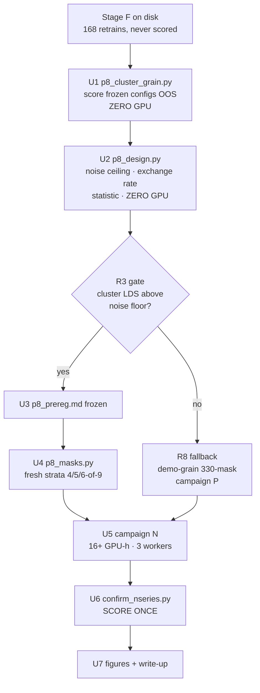

# PASS 8 PLAN -- cluster-grain attribution

**Created:** 2026-07-27 · **Box:** h200-3 · **Base commit:** 2da19be · **Budget:** 16+ GPU-h

---

## Summary

Pass 7 closed the demo-grain question: the C5 self-influence correction is
`Delta rho = +0.06, 95% CI [-0.02, +0.14]` over 192 out-of-sample masks. Its own diagnosis of why
that number is small is BLOCKERS #33/#35 -- **the demo grain is signal-starved at 135 demos**.
Swapping one demo of 68 moves the outcome by 0.44 seed-noise sd, so the unit of attribution sits
below the noise floor.

Pass 8 attacks the grain, not the estimator. It asks: **is the weakness a property of influence
functions, or of a 1-demo unit?** The unit becomes a cluster of 15 demos.

The pass has an unusually cheap opening move. `runs/stage_F` holds **168 completed retrains** --
72 balanced cluster masks (5 of 9 clusters = 75 demos) x seeds 301/302, plus 12 noise-ceiling
masks x seeds 303/304. They were built as attribution-agnostic ground truth and, per pass 7's
HANDOFF open thread #3, **were never used for attribution**. Every estimator the if_repair package
has ever frozen is therefore out-of-sample on all 72 masks, and scoring them there costs **zero
GPU**. That is BLOCKERS #28's lesson -- *score every frozen config on every draw it is OOS on,
before building anything* -- applied to the one untouched draw in the repo.

Only after that scoring reports does GPU get spent, on a preregistered confirmation draw.

---

## Problem Frame

**What pass 7 established that constrains this pass**

| Finding | Source | Consequence for pass 8 |
|---|---|---|
| Demo grain is signal-starved (1 demo = 0.44 seed-noise sd) | BLOCKERS #35 | Motivates the grain change |
| Masks beat seeds ~5:1; buy masks at depth 2-3 | BLOCKERS #29 | Sets campaign allocation -- **but see R4** |
| Pick the LDS statistic on reliability+noise only, never on the contrast | BLOCKERS #30 | Kendall tau_b primary, Spearman secondary, re-derived at cluster grain |
| Frozen-before-a-draw != unselected-upon; winner's curse ~4x | BLOCKERS #28 | Stage F is virgin; report with and without any discovery draw |
| Score-once, no optional stopping | p7_prereg.md §7 | Campaign N is scored exactly once |

**The new constraint pass 8 must confront.** At cluster grain the mask space is combinatorially
bounded: `C(9,5) = 126` distinct 5-of-9 masks exist and Stage F already consumed 72 of them. At most
54 genuinely fresh 5-of-9 masks remain. The pass-7 exchange rate was measured where masks were
effectively unlimited; **at cluster grain masks are a depletable resource and seeds are not**, so
the 5:1 rule cannot be assumed to carry over. Re-measuring it is a required design step (U2), not
an optional one.

---

## Requirements

- **R1** Score every frozen if_repair estimator config at cluster grain on Stage F's 72 masks, out
  of sample, before any new code or GPU is committed.
- **R2** Establish the cluster-grain noise ceiling and paired sd from the existing 12 noise-ceiling
  masks x 4 seeds, so the bar is known before the hypothesis is chosen.
- **R3** Report whether cluster-grain LDS sits above the noise floor that killed demo grain --
  the pass's central question.
- **R4** Re-measure the mask/seed exchange rate **at cluster grain**, where the mask axis is capped
  at 126, and let the measurement (not the pass-7 rule) set campaign N's allocation.
- **R5** Choose the primary LDS statistic on reliability and noise alone, blind to any contrast.
- **R6** Preregister campaign N as a single-hypothesis confirmation, frozen and committed while the
  campaign has zero runs; score exactly once.
- **R7** Spend 16+ GPU-h on the preregistered confirmation draw.
- **R8** If R3 fails -- cluster grain is not above the noise floor -- fall back to the sanctioned
  demo-grain powered confirmation (HANDOFF: ~330 masks, ~660 retrains, ~17 solo-h) so the budget
  still buys a resolving result.
- **R9** Leave the repo with FINDINGS / RESULTS / BLOCKERS / HANDOFF updated and a GPU ledger.

**Non-goals.** Everything on the passes 4-7 do-not-re-run lists: the W2 duel design, the 24x10
allocation, W3 wider/second-order exact LOO, extending campaign M, benchmarking against
`GradDot_unitL2`, six concurrent trainers. Porting to a 500+ demo corpus (HANDOFF open thread #1)
is out of scope for this pass -- it is a data-engineering effort measured in days, not a 16-hour
GPU spend, and cluster grain tests the same underlying claim using data already on disk.

---

## Key Technical Decisions

**KTD1 -- Attack the grain, not the estimator.** Seven passes of estimator work produced one
effect of +0.06. The repo's own diagnosis says the unit is too small. Cluster grain raises the
unit from 1 demo to 15 and is the only open thread testable from inside this repo.

**KTD2 -- Stage F is the free out-of-sample draw, and it is spent first.** 168 retrains already on
disk, never used for attribution. This inverts the usual order: measurement before construction.
If Stage F says cluster grain is no better, the pass pivots (R8) having spent no GPU.

**KTD3 -- `include_only_target_masks=True` is the honest conditional.** `src/analysis.py` already
marks the full-72 number `INFLATED`, because a mask that drops the target cluster entirely has its
outcome dominated by that removal rather than by the attribution ordering. Conditioning on
target-in-mask gives n=40 per target (each cluster sits in exactly 40 of 72 masks). n=40 with 8
free predictors is far better conditioned than demo grain's 24-192 masks against 135 demos.

**KTD4 -- Fresh masks come from disjoint strata, with |S| as a control.** 54 fresh 5-of-9 masks is
not enough for a powered confirmation. Campaign N draws additionally from 4-of-9 (`C(9,4)=126`) and
6-of-9 (`C(9,6)=84`). Cluster count per mask changes the training-set size (60/75/90 demos), which
confounds the outcome, so |S| is stratified and controlled exactly as `demo_grain_lds` already
partials out in-target demo count.

**KTD5 -- Reuse frozen configs by import, never by re-implementation.** Campaign N imports from
`p7_pooled_oos.CONFIGS` the same way `confirm_mseries.py` does. BLOCKERS #14 came through a
re-implementation gap.

---

## High-Level Technical Design

The gate at D is the whole point of the design: it is reached having spent zero GPU, and it routes
the entire budget to whichever arm the measurement supports.

---

## Implementation Units

### U1. Cluster-grain out-of-sample scoring of every frozen config

**Goal.** Score every frozen if_repair estimator at cluster grain against Stage F's 72 masks.
Answers R1 and produces the number the rest of the pass routes on.

**Requirements.** R1, R3.
**Dependencies.** none.
**Files.** `if_repair/p8_cluster_grain.py`, `if_repair/tests/test_p8_cluster.py`,
`if_repair/results/p8_stageF_oos.csv`.

**Approach.** Load `results/stage_F_outcomes.parquet` (regenerate via
`python -m src.stage_efg --stage F --collect_only` if absent) and `results/mask_manifest.json`.
Lift each config from `p7_pooled_oos.CONFIGS` to cluster grain by summing its per-demo scores over
the demos of each included cluster, then correlate against the seed-mean outcome across the 40
target-in masks. Report per target, per outcome key, under both statistics, paired against
`GradDot_dmean` on identical masks.

**Patterns to follow.** `src/analysis.py:107 cluster_grain_lds` for the grain lift and the
`INFLATED` naming discipline; `confirm_mseries.py` for frozen-config import and the paired-bootstrap
shape.

**Execution note.** Every config here is out-of-sample by construction, so this is a report, not a
test with a bar. Resist attaching a hypothesis to it -- U3 does that, afterwards.

**Test scenarios.**
- Cluster lift of a config equals the sum of its per-demo scores over the cluster's 15 demos.
- Conditional mask count is exactly 40 for every one of the 9 targets (the manifest's balance
  constraint) -- fails loudly if the manifest changed.
- Full-72 and conditional-40 numbers differ, and only the conditional one is written to the
  reported column; the full-72 column carries `_INFLATED` in its name.
- A config whose scores are constant yields NaN, not a spurious 0 or a pass.
- Scoring is invariant to demo ordering within a cluster.

**Verification.** `p8_stageF_oos.csv` holds one row per (config, target, outcome, statistic) with
conditional rho, paired delta vs GradDot_dmean, CI, and n=40; every existing config appears.

---

### U2. Cluster-grain design measurement -- ceiling, exchange rate, statistic

**Goal.** Establish the bar and the allocation before any hypothesis exists. Answers R2, R4, R5.

**Requirements.** R2, R4, R5.
**Dependencies.** U1.
**Files.** `if_repair/p8_design.py`, `if_repair/tests/test_p8_design.py`,
`if_repair/results/p8_design.csv`.

**Approach.** Three hypothesis-blind stages mirroring `p7_design.py`.
- `--stage ceiling`: split-half noise ceiling at cluster grain from the 12 noise-ceiling masks x
  seeds 301-304, with the Spearman-Brown step, Kendall labelled approximate as in pass 7.
- `--stage allocation`: paired sd as a function of (n_masks, seed_depth) at cluster grain, by
  subsampling Stage F. **The pass-7 answer is not assumed** -- with the mask axis capped at 126,
  report the exchange rate and the sd reachable at the cap, and derive campaign N's allocation from
  that curve.
- `--stage statistic`: Kendall tau_b vs Spearman on split-half reliability and paired sd only,
  computed and committed before any contrast is run under it.

**Execution note.** Commit this stage's output before U3 is written. The statistic must be chosen
where it cannot see the hypothesis -- that is the entire defensibility argument of BLOCKERS #30.

**Test scenarios.**
- Ceiling uses only the 12 noise-ceiling masks and all 4 seeds; using seeds 301/302 alone raises it
  (pinned as a guard against silently dropping the replicate seeds).
- Paired sd falls monotonically in n_masks on subsampled Stage F.
- The allocation stage refuses to recommend more 5-of-9 masks than the 126-cap minus Stage F's 72.
- The statistic stage's output contains no contrast column -- asserted structurally, so a future
  edit cannot leak the hypothesis into the choice.
- Spearman-Brown applied to a perfectly reliable split returns 1.0.

**Verification.** `p8_design.csv` states the cluster-grain ceiling with CI, the sd-vs-allocation
curve, the recommended campaign-N allocation, and the selected statistic with its reliability
justification.

---

### U3. Preregister campaign N

**Goal.** Freeze the single hypothesis, the allocation, and the score-once rule before GPU. R6.

**Requirements.** R6.
**Dependencies.** U1, U2.
**Files.** `if_repair/p8_prereg.md`.

**Approach.** Follow `p7_prereg.md`. State the hypothesis of record chosen from U1's report,
alpha (family of one -> 0.05), the primary and secondary statistics from U2, the exact allocation
from U2, the bars (paired and absolute-vs-ceiling), and an explicit no-optional-stopping clause.
Record the R3 gate verdict and, if the fallback fired, why. Commit while campaign N has zero runs.

**Execution note.** Do not open this file again after the first campaign-N retrain lands.

**Test expectation: none** -- documentation unit. Its enforcement lives in U6's score-once check.

---

### U4. Fresh cluster-mask draw across strata

**Goal.** Build campaign N's masks: disjoint from Stage F, stratified over |S| in {4,5,6}. R4.

**Requirements.** R4, R7.
**Dependencies.** U2, U3.
**Files.** `if_repair/p8_masks.py`, `if_repair/tests/test_p8_masks.py`,
`if_repair/results/p8_mask_manifest.json`.

**Approach.** Generalize `src/masks.py:build_cluster_masks` to arbitrary `per` and a caller-supplied
exclusion set, preserving its two invariants (exact per-cluster balance, co-inclusion in the design
band) and its swap-repair. Emit a manifest per stratum with the same audit fields plus the
exclusion proof.

**Test scenarios.**
- Zero intersection with Stage F's 72 mask signatures -- the out-of-sample guarantee, pinned.
- Every mask has exactly `per` clusters; each cluster's inclusion count is exactly balanced within
  its stratum.
- Off-diagonal co-inclusion lands inside the band for each stratum, or the builder raises rather
  than emitting an unbalanced design.
- Requesting more masks than the stratum's `C(9,per)` capacity minus exclusions raises a clear
  error instead of silently returning duplicates.
- Same seed reproduces the identical manifest bit-for-bit.

**Verification.** Manifest passes its own audit; the disjointness assertion is a test, not a
comment.

---

### U5. Campaign N -- the GPU spend

**Goal.** Run the preregistered confirmation draw. R7 (16+ GPU-h).

**Requirements.** R7.
**Dependencies.** U3, U4.
**Files.** `if_repair/retrain.py` (campaign N wiring), `if_repair/tests/test_p8_campaign.py`.

**Approach.** Wire campaign N into `retrain.py` beside campaigns J-M, reading the U4 manifest and
U2's allocation. Run **3 concurrent workers** -- BLOCKERS says 3 saturates the H200 at 137 s/run and
6 is a net throughput loss. Each worker is resumable and skips completed run dirs, because the box
is preemptible and its IP moves on restart. Log to `if_repair/runs/campaigns/N/`.

**Execution note.** Launch detached (`nohup`) so an SSH drop cannot kill 16 hours of work; a
detached job has no forwarded agent and therefore cannot `git push` -- pushing stays a foreground
step. Verify the first few run dirs land before leaving it unattended.

**Test scenarios.**
- Campaign N appears in the campaign registry with its seeds and allocation, and its seeds do not
  collide with any of A-M.
- Worker sharding partitions the job list exactly -- no job run twice, none dropped, for each of
  `nworkers` in {1,2,3}.
- A completed run dir is skipped on relaunch (resumability under preemption).
- The job list matches the U4 manifest's mask count times the U2 seed depth.

**Verification.** Expected run-dir count present under `campaigns/N/`, each with `outcomes.json`;
GPU ledger records wall and solo-GPU hours.

---

### U6. Score campaign N exactly once

**Goal.** Produce the pass's headline number. R6.

**Requirements.** R3, R6.
**Dependencies.** U5.
**Files.** `if_repair/confirm_nseries.py`, `if_repair/tests/test_p8_confirm.py`,
`if_repair/results/p8_confirm_nseries.csv`.

**Approach.** Mirror `confirm_mseries.py`: import the frozen config, apply the U3 statistic, report
paired delta with bootstrap CI and one-sided p, plus the absolute ratio against the U2 cluster
ceiling. Stratum is a control, per KTD4. Write once; the script refuses to overwrite an existing
result file.

**Execution note.** Run it once, on the complete campaign. Re-running to see a number move is the
failure mode `p7_prereg.md` §7 exists to prevent.

**Test scenarios.**
- The scored config is bit-for-bit the frozen `p7_pooled_oos.CONFIGS` entry named in `p8_prereg.md`.
- A second invocation with an existing result file exits non-zero without rewriting it.
- Paired bootstrap over masks with a fixed seed is reproducible.
- Stratum control changes the estimate when strata are imbalanced and is a no-op when balanced.
- In-sample scoring of any outcome-consuming estimator is refused (the `demo_grain_lds` `X@beta`
  circularity trap, already pinned at demo grain -- pin it at cluster grain too).

**Verification.** One row per bar with delta, CI, p, n, and stratum breakdown.

---

### U7. Figures, docs, ledger

**Goal.** Leave the repo self-explanatory. R9.

**Requirements.** R9.
**Dependencies.** U6.
**Files.** `if_repair/p8_figs.py`, `if_repair/FINDINGS.md`, `if_repair/RESULTS.md`,
`if_repair/BLOCKERS.md`, `if_repair/HANDOFF.md`, `if_repair/gpu_ledger_pass8.py`,
`if_repair/figs/p8_*.png`.

**Approach.** A grain-comparison forest plot (demo grain from pass 7 vs cluster grain from this
pass, on the same axis) is the pass's teaching artifact. Add BLOCKERS entries continuing from #35.
Rewrite HANDOFF for pass 9.

**Test expectation: none** -- figures and prose. Numbers come from committed CSVs, never retyped.

---

## Verification Contract

1. `pytest if_repair/tests -q` green (97 tests at 2da19be, plus this pass's).
2. Every reported number traces to a committed CSV under `if_repair/results/`.
3. `p8_prereg.md` committed before campaign N's first run dir exists -- checkable in git log.
4. `confirm_nseries.py` invoked exactly once -- checkable in shell history and the write-once guard.
5. GPU ledger reconciles to 16+ hours.

## Definition of Done

Cluster-grain attribution is measured out of sample against a preregistered bar; the pass states
plainly whether raising the unit from 1 demo to 15 lifts influence-function attribution above the
noise floor that bounded demo grain; docs and HANDOFF updated; work committed and pushed.

---

## Risks

| Risk | Mitigation |
|---|---|
| Stage F scoring shows cluster grain no better than demo grain | This is a real result, not a failure -- and R8's fallback keeps the GPU budget productive |
| Mask-space cap (126) limits achievable power at cluster grain | U2 measures the sd reachable at the cap *before* prereg; KTD4's strata widen the space to 336 |
| Box is preemptible; IP moves on restart | Resumable workers, detached launch, run dirs are the state |
| Stratum confound (|S| changes train size) | Stratified design + explicit control, mirroring the existing in-target-count partial |
| Re-implementation drift from frozen configs | Import from `p7_pooled_oos.CONFIGS`; pinned by test (BLOCKERS #14) |

## Assumptions

- `results/stage_F_outcomes.parquet` is regenerable from the 168 run dirs via `--collect_only`
  (artifact-only collection; no GPU).
- Cached per-demo scores for the frozen configs are reusable at cluster grain without recomputing
  gradients; if any config's cache is missing, recomputing it is minutes of GPU, not hours.
- 3 concurrent workers at ~137 s/run gives ~1260 retrains in 16 h wall.
